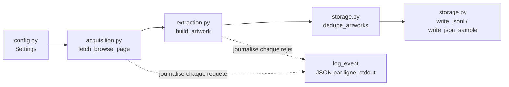

# Architecture

## Flux de donnees

## Les six responsabilites et ou elles vivent

| Responsabilite | Fichier | Entree | Sortie |
|---|---|---|---|
| Configuration | `src/harvest/config.py` | variables d'environnement (`HARVEST_*`) | `Settings` (dataclass) |
| Acquisition | `src/harvest/acquisition.py` | `offset`, `load_amount` | dictionnaire JSON brut (`records`, `info`), ou `None` si echec |
| Extraction / normalisation | `src/harvest/extraction.py` | un enregistrement brut (`dict`) | `Artwork` valide, ou `None` (rejet journalise) |
| Modele et validation | `src/harvest/models.py` | champs normalises | `Artwork` (Pydantic), leve `ValidationError` si invalide |
| Export | `src/harvest/storage.py` | liste d'`Artwork` | `data/artworks.jsonl`, `samples/sample_output.json`, dedup |
| Journalisation / erreurs | `log_event()` dans `acquisition.py`, utilise par `extraction.py` | evenements (`page_fetched`, `item_rejected`, `retry_scheduled`, `blocked`...) | une ligne JSON par evenement sur stdout |

Ces six responsabilites sont regroupees dans 6 fichiers (un peu plus que le minimum "deux fichiers" tolere par l'enonce), pour eviter qu'un seul fichier ne melange acquisition et extraction — mais volontairement sans framework d'orchestration (pas de Prefect/Airflow) : une seule cible, une seule execution bornee, un `while` explicite dans `collect.py` suffit et reste entierement lisible.

## Decisions de conception

### Decision 1 — endpoint JSON interne plutot que rendu Playwright en continu

**Choix retenu :** appeler directement `GET /browse?offset=...&load_amount=...` avec `httpx`, sans jamais ouvrir de navigateur pendant la collecte reelle.
**Alternative ecartee :** piloter Playwright en continu (ouvrir la page, attendre le rendu, lire le DOM ou re-intercepter la reponse a chaque page).
**Pourquoi ecartee :** un navigateur complet coute un ordre de grandeur de plus en memoire et en temps par page (mesure du cours : facteur 10 a 50), pour un resultat strictement identique ici puisque l'endpoint JSON est deja public et ne demande aucune session. Playwright a neanmoins ete utilise **une fois**, en phase de diagnostic (`docs/cible.md`), pour observer quel appel reseau la page declenchait reellement — ce que `curl` seul n'aurait pas revele.

### Decision 2 — identifiant stable = `objectid` (entier interne), pas `objectnumber` (numero d'inventaire)

**Choix retenu :** utiliser le champ `objectid` (entier, garanti present et unique par le musee, directement present dans l'URL de la fiche) comme identifiant de deduplication et de tracabilite.
**Alternative ecartee :** utiliser `objectnumber` (le numero d'inventaire du musee, ex. `"1931.162.A"`).
**Pourquoi ecartee :** un numero d'inventaire peut etre partage par plusieurs objets d'un meme lot (suffixes `.A`, `.B`...) et n'est pas garanti unique dans notre echantillon ; `objectid` est la cle interne que le musee lui-meme utilise pour distinguer chaque fiche (elle apparait dans `url`), donc plus fiable comme identifiant technique, au prix d'etre moins lisible pour un humain (on garde `objectnumber` comme champ d'information, pas comme cle).

## Ancrage des deux champs les plus importants

Notre source est du JSON, pas du HTML : il n'y a pas de selecteur CSS/XPath a ancrer, mais le meme raisonnement de stabilite s'applique aux noms de champs d'un contrat de donnees.

| Champ | Ancrage retenu | Pourquoi plus stable qu'une alternative ecartee | Si l'ancrage disparait demain |
|---|---|---|---|
| `object_id` (identifiant) | Cle `objectid` de la reponse JSON `/browse` | Alternative ecartee : deriver un identifiant depuis la position de l'objet dans la page (index de liste). Une position change des qu'un objet est insere/retire du catalogue ; `objectid` est une cle de base de donnees, stable par construction et deja utilisee dans l'URL publique de la fiche. | `record["objectid"]` leve un `KeyError`, intercepte dans `build_artwork` (`extraction.py`), journalise comme `item_rejected` avec la raison exacte : l'objet est ignore individuellement, la collecte continue sur les suivants (pas de plantage, pas d'enregistrement silencieusement incomplet). |
| `title` | Cle `title` de la meme reponse JSON | Alternative ecartee : lire un `<h1>` ou une classe CSS sur la page de fiche detail HTML rendue. Cette page est visuellement redessinable sans toucher au contrat de donnees JSON, qui est aussi ce que le propre frontend Vue du site consomme pour s'afficher — le musee a lui-meme interet a ne pas le casser silencieusement. | Le validateur Pydantic (`_not_blank` dans `models.py`) rejette un titre vide ou absent ; `build_artwork` capture la `ValidationError`, journalise `item_rejected` et retourne `None`. Le champ est marque obligatoire et se comporte comme tel : pas de titre vide silencieusement exporte. |

## Ce qui est volontairement absent

Pas de base de donnees, pas d'interface graphique, pas d'orchestrateur, pas de conteneur : la cible est unique, la collecte est bornee et ponctuelle (pas de planification recurrente demandee), un script Python avec un fichier de sortie JSONL suffit et reste entierement explicable en 5 minutes.
